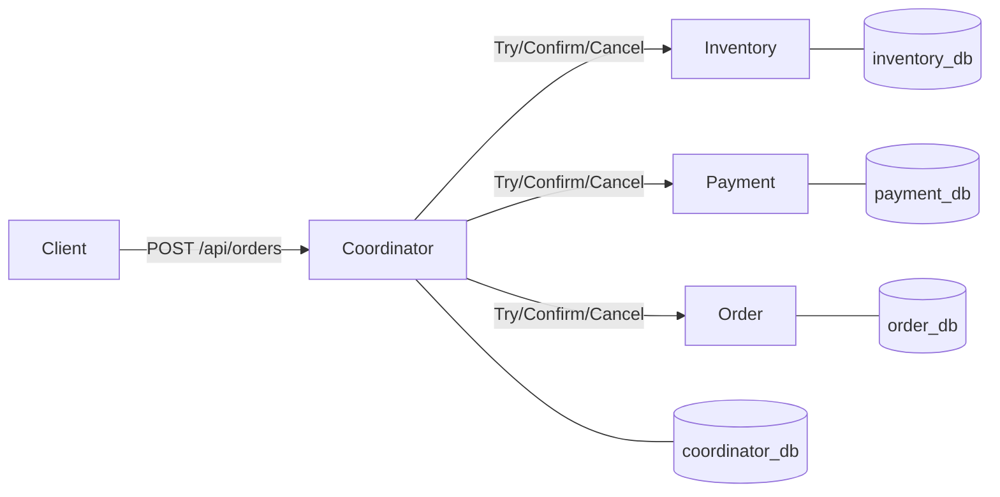

# TCC — A Hand-Rolled Distributed Transaction Lab

A learning project that re-implements the **Try-Confirm-Cancel (TCC)** distributed
transaction pattern from scratch in Java 21 / Spring Boot 3 / PostgreSQL, **mimicking
the internals of Oracle MicroTx's TCS (Transaction Coordinator Service)**. Every
failure mode that XA / JTA / MicroTx normally hide is exposed: idempotency,
partial failure, coordinator crash recovery, heuristic outcomes.

**Banned on purpose:** XA, JTA, MicroTx, Kafka, external workflow engines.
Cross-service atomicity is achieved with a state machine in tables and a recovery
loop. That's the lesson.

---

## What's modeled

A customer places an order for one item. Three resources must be coordinated atomically:

1. **Reserve inventory** (decrement available, increment reserved)
2. **Authorize payment** (decrement balance, increment frozen)
3. **Create a pending order**

The coordinator drives the protocol and the recovery loop. If all Try steps succeed,
it confirms everyone. If any Try fails, it cancels the participants that succeeded
plus writes preventive tombstones for the ones that didn't (closes the late-Try race).

---

## Architecture

```
                       ┌───────────────────────────────────┐
   client ─POST /api/orders──▶  coordinator-service  :8080  │
                       │   (global tx state machine,        │
                       │    @Scheduled recovery loop)       │
                       └─────┬───────────┬───────────┬─────┘
                             │           │           │
                  Try/Confirm/Cancel over HTTP
                  (X-Tx-Id, X-Fail-At, X-Sleep-Millis)
                             │           │           │
                ┌────────────▼─┐  ┌──────▼──────┐  ┌─▼──────────┐
                │ inventory-   │  │ payment-     │  │ order-     │
                │ service :8081│  │ service :8082│  │ service:8083│
                └──────┬───────┘  └──────┬───────┘  └─────┬──────┘
                       │                 │                │
                  inventory_db        payment_db       order_db
                  coordinator_db (separate DB per service)
```



---

## Local transaction vs distributed transaction

**Local transaction.** A single database transaction (`BEGIN; … COMMIT;`) backed by
the storage engine's ACID guarantees. `@Transactional` in Spring delegates to the
JDBC driver, which talks to one database. This is what every participant uses
*internally* — `@Transactional` covers the row-level operations on `product` and
`inventory_reservation` together so they atomically commit or roll back.

**Distributed transaction.** "Atomic" outcome across multiple databases /
services / processes. There is no single `COMMIT` you can issue. Naive options:

- **2PC (XA)**: a coordinator holds prepare/commit phases with locks across all
  resources. Strong, but it serializes through the coordinator and holds DB locks
  for the whole protocol — terrible for throughput, brittle for availability.
- **Saga**: a chain of local transactions, each compensated if a later one fails.
  Async-friendly but no isolation: between Try and Confirm, *partial* state is
  visible to other actors.
- **TCC (this project)**: like Saga but with an explicit *reservation* phase. Try
  commits the reservation locally (releasing DB locks immediately); the business
  treats reserved-but-not-committed resources as unavailable. Confirm or Cancel
  finalizes. Better isolation than Saga, much shorter lock windows than 2PC.

**Why TCC needs `@Transactional` only inside one service**: the lock is in the
data model (`reserved_qty`, `frozen_amount`), not in the transaction manager.
That's exactly the trick that lets each Try complete its local transaction and
release DB locks before the next service runs.

---

## Mapping our code to MicroTx concepts

| MicroTx                                        | This project                                            |
|------------------------------------------------|---------------------------------------------------------|
| TCS (Transaction Coordinator Service)          | `coordinator-service`                                   |
| TCS transaction log                            | `global_transaction` + `transaction_participant` tables |
| TCS recovery scheduler                         | `RecoveryService` (`@Scheduled`)                        |
| Participant TCC library (auto-instrument Java) | Hand-written `*TccController` + `*TccService` per svc   |
| XID / global transaction id                    | `tx_id` (UUID) propagated via path + `X-Tx-Id` header   |
| Heuristic outcomes                             | `GlobalTxState.HEURISTIC` (no auto-retry past this)     |
| `@LRA` style annotations                       | Plain REST: POST=Try, PUT=Confirm, DELETE=Cancel        |

---

## Quick start

```bash
mvn -DskipTests package
docker compose up --build -d
```

Wait ~20 seconds for all services to be healthy, then:

```bash
# place an order — happy path
curl -s -X POST http://localhost:8080/api/orders \
  -H 'Content-Type: application/json' \
  -d '{"customerId":"CUST-1","sku":"SKU-A","qty":1,"amount":100.00}'

# ➜ {"txId":"...","state":"CONFIRMED","attemptCount":1, ...}
```

See [`docs/curl-examples.md`](docs/curl-examples.md) for every scenario.

---

## Failure injection cheat sheet

Each participant honors three test-only headers via
[`FailureInjectionFilter`](tcc-common/src/main/java/com/tcc/common/failure/FailureInjectionFilter.java):

| Header          | Effect                                                   |
|-----------------|----------------------------------------------------------|
| `X-Fail-At: TRY`     | Reject POST /tcc/* with 500 *before* business logic |
| `X-Fail-At: CONFIRM` | Reject PUT /tcc/* with 500                          |
| `X-Fail-At: CANCEL`  | Reject DELETE /tcc/* with 500                       |
| `X-Sleep-Millis: N`  | Sleep N ms before processing (simulate slow downstream) |

The coordinator forwards these from its inbound API:

| Coordinator header                    | Forwarded to participants as |
|---------------------------------------|------------------------------|
| `X-Inject-Fail-At-Participant`        | `X-Fail-At` (all phases)     |
| `X-Inject-Confirm-Sleep-Millis`       | `X-Sleep-Millis` on Confirm  |

---

## Test scenarios

| # | Module / class                                        | What it proves                                          |
|---|-------------------------------------------------------|---------------------------------------------------------|
| 1 | `e2e-tests/HappyPathTest`                             | All participants succeed → CONFIRMED everywhere         |
| 2 | `e2e-tests/PaymentTryFailsTest`                       | Inventory Tries OK, payment fails → all CANCELLED       |
| 3 | `e2e-tests/IdempotencyTest#duplicateConfirm`          | Duplicate Confirm doesn't double-apply                  |
| 4 | `e2e-tests/IdempotencyTest#duplicateCancel`           | Duplicate Cancel doesn't double-restore                 |
| 5 | `e2e-tests/TerminalStateGuardTest#confirmAfterCancel` | Confirm-after-Cancel returns 409                        |
| 6 | `e2e-tests/TerminalStateGuardTest#cancelAfterConfirm` | Cancel-after-Confirm returns 409                        |
| 7 | `e2e-tests/ConfirmTimeoutRecoveryTest`                | Slow Confirm times out, recovery re-drives → CONFIRMED  |
| 8 | `e2e-tests/CoordinatorCrashRecoveryTest`              | DB-seeded crashed-coordinator state → recovered to terminal |

Each service also has slice tests against a real Postgres (Testcontainers) covering
its own TCC handlers' idempotency and state-transition guards. The coordinator has
SpringBoot tests with mocked `ParticipantClient` covering scenarios 1, 2, 5, 6, 7, 8
in pure-orchestration form.

---

## Running tests

```bash
mvn test                # everything; Docker-dependent tests are auto-skipped if Docker is absent
mvn -pl coordinator-service test    # just one module
```

The slice/e2e tests use `@EnabledIf("dockerAvailable")`, so the build stays green
even on machines without Docker.

---

## Out of scope (for clarity)

- XA, JTA, MicroTx integration — banned on purpose
- Async coordination (Kafka, Saga) — would obscure TCC's synchronous structure
- HA coordinator (leader election) — single coordinator with recovery is enough
- Auth, observability, multi-tenant — this is a learning lab

A "phase 2" would add OTel tracing across services, Saga comparison module, and
HA coordinator election.


## Client retry safety

Send a stable `Idempotency-Key` for each intended order and reuse it after timeouts or lost responses:

```bash
curl -s http://localhost:8080/api/orders \
  -H 'Content-Type: application/json' \
  -H 'Idempotency-Key: checkout-7efb9d42' \
  -d '{"customerId":"CUST-1","sku":"SKU-A","qty":1,"amount":100.00}'
```

The same key and order details return the same `txId` and its **current** status. Concurrent retries share one transaction. A different customer, SKU, quantity or amount under the same key returns `409` with code `IDEMPOTENCY_KEY_REUSED`. JSON property order and equivalent monetary values (`100`, `100.0`, `100.00`) do not change request identity.

Keys are case-sensitive, 1–128 ASCII letters/digits or `.`, `_`, `:`, `-`; invalid keys return `400`. The header is optional for compatibility: requests without it still create a new transaction every time. Use a new key for an intentional new order, including after a cancelled order. Retrying a non-terminal transaction may resume recovery; terminal transactions, including `HEURISTIC`, are never restarted. Replays ignore fault-injection headers.

Keys and request identity are committed atomically with the global transaction and participant log in coordinator_db (migration V3), before any RPC. No automatic expiration or deletion is provided: removing a key would allow a late retry to create another order. Keys have a global namespace for this unauthenticated lab endpoint; use UUIDs or a client namespace, and scope keys to authenticated principals if adding multi-tenant authentication. A key is not an authorization credential.
