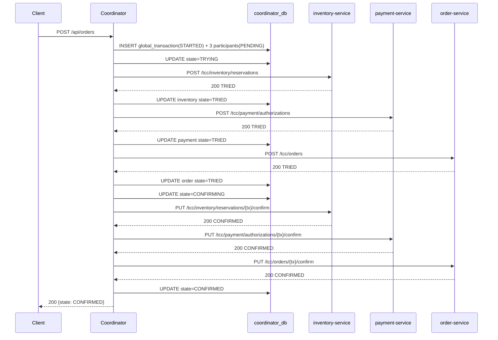
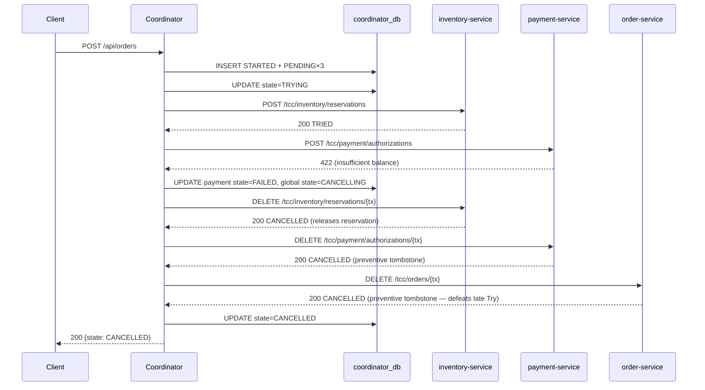
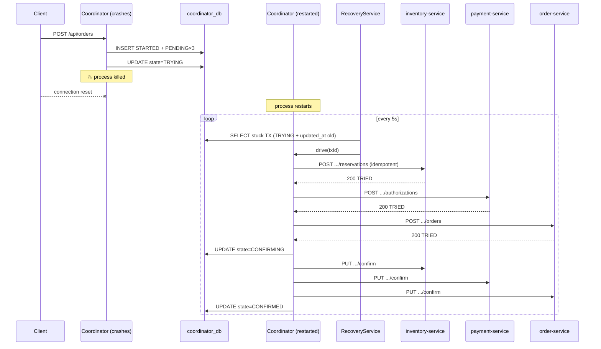
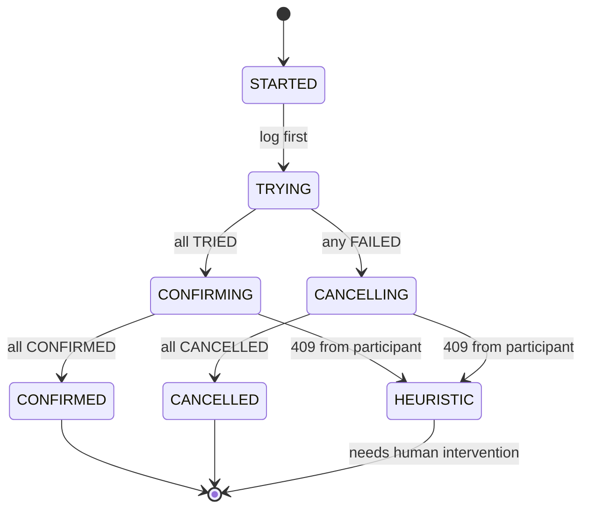
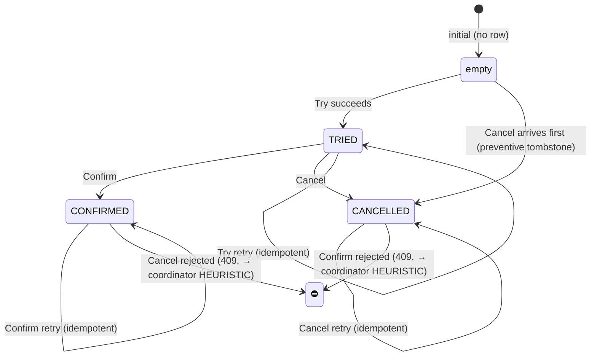

# Sequence Diagrams

## 1. Happy path — all Try succeed, all Confirm succeed



## 2. Payment Try fails — Cancel everyone



## 3. Confirm timeout — recovery re-drives

```mermaid
sequenceDiagram
    participant C as Client
    participant Co as Coordinator
    participant DB as coordinator_db
    participant Sched as RecoveryService
    participant I as inventory-service

    C->>Co: POST /api/orders (X-Inject-Confirm-Sleep-Millis: 8000)
    Co->>DB: STARTED → TRYING → all TRIED → CONFIRMING
    Co->>I: PUT /tcc/.../confirm  (X-Sleep-Millis: 8000)
    Note right of I: Filter sleeps 8s; coordinator's read timeout is 2s
    Co--xI: read timeout
    Co->>DB: mark inventory.last_error="timeout"; state stays CONFIRMING
    Co-->>C: 200 {state: CONFIRMING}  (not yet terminal)

    loop every 5s (fixedDelay)
        Sched->>DB: SELECT stuck TX (CONFIRMING + updated_at < now()-8s)
        Sched->>Co: drive(txId)
        Co->>I: PUT /tcc/.../confirm  (no sleep header this time)
        I-->>Co: 200 CONFIRMED
        Co->>DB: UPDATE state=CONFIRMED
    end
```

## 4. Coordinator crash during TRYING — recovery resumes



## 5. Coordinator state machine



## 6. Participant state machine


